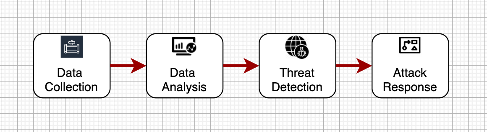

# CyberActive

## What we build
[CyberActive](https://www.cyberactive.com) is a unified cybersecurity platform that combines the power of Artificial Intelligence, Deep Learning, and End-to-End Automation to identify and eliminate security vulnerabilities, prevent security collapses and data loss. CyberActive works by collecting and correlating data across various network points such as servers, email, cloud workloads, and endpoints. The system analyzes the correlated data, lending it visibility and context, and revealing advanced threats. Thereafter, the threats are prioritized, analyzed, and sorted to prevent security vulnerabilities.

<table width="256px">
  <tr>
    <td></td>
  </tr>
  <tr>
    <td><a href="./docs/system-design.md">Click for more info</a></td>
  </tr>
</table>

[Click for more info](./docs/system-design.md)

## How we build

