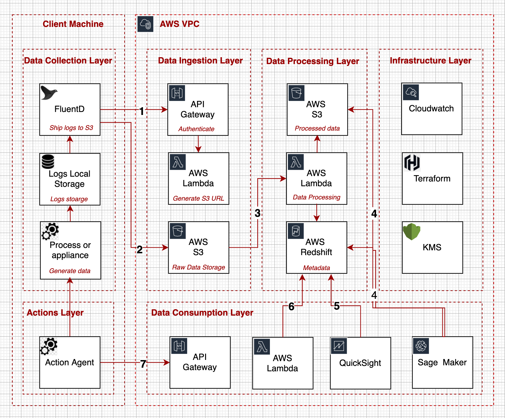
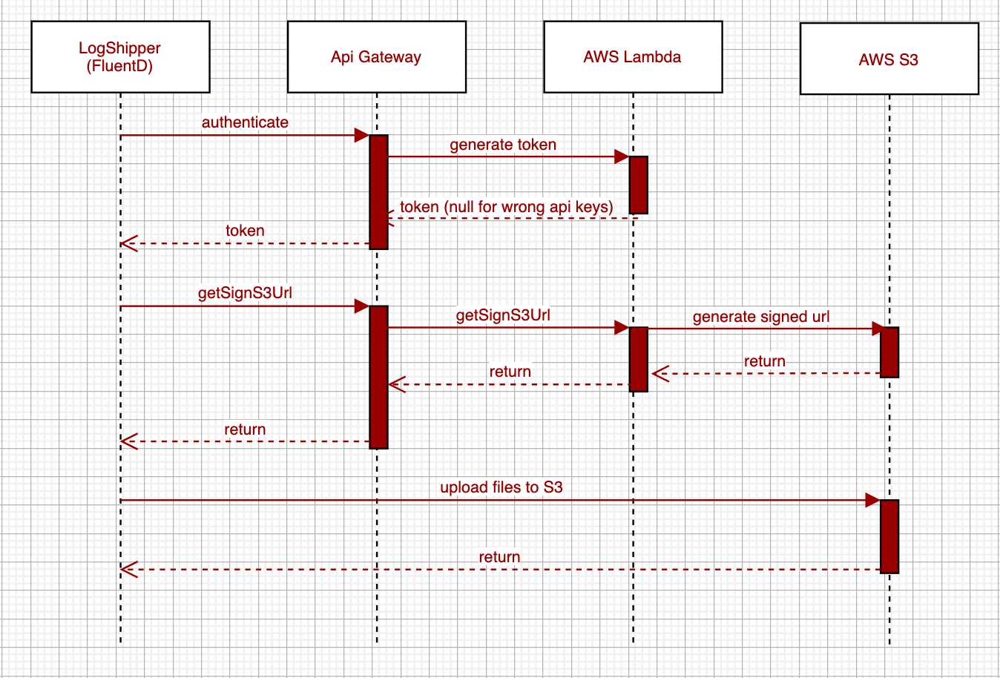

# CyberActive MVP - System Design

## Background
This document contains the CyberActive MVP System Design. The main goal of the MVP is to provide enough features to be usable by early customers and ML researchers, who can then provide feedback for future development. The MVP scope of work should be minimal and just enough. It should be possible to implement and maintain the MVP by a small group of 2-3 developers on a time frame of a couple of weeks. Operational cost is also an important aspect and will be addressed later.

## Requirements

### Functional
[TBD]()

### Non-Functional
- Maintainability
    1. MVP will be maintained by a small team. CyberActive MVP should be created by using the lean engineering approach where we rely on managed AWS services and the lean tech stack.  
    2. To reduce the scope, the MVP should implement batch pipelines only. Batch pipelines will simulate streaming capabilities by performing micro-batches (up to 5 mins latency)
    3. Provide CI/CD design
    4. Provide E2E Testing design 
    5. Provide Logging and Metrics design 
- Capacity
    1. The target MVP data capacity is small - up to hundreds of MB of input data per hour.
    2. The System should be scalable to any volume of the input data
    3. The provided solution should be Highly Available (MultiAZ) and Reliable. Cover the automatic recovery from failures. 
- Cost
    1. Design a solution that uses AWS Free tier as much as possible. Estimate the total monthly AWS cost of the CyberActive MVP
    2. Provide a solution for the security and governance layer. Describe how the data is protected on transit and rest.Design access control, encryption, network protection, usage monitoring, and auditing. 

## System APIs

## High-Level Design
The proposed architecture is a stack of six logical layers: data collection, data ingestion, data processing, data consumption (analysis), infrastructure, and action(response). Each layer consists of multiple components. All components are managed AWS services like API Gateway, AWS Lambda, AWS S3, etc. 
The Layered Architecture approach promotes separation of concerns and flexibility to add or remove data sources, add new data consumers, change processing methods.
<table width="256px">
  <tr>
    <td></td>
  </tr>
  <tr>
    <td>Architecture Diagram</td>
  </tr>
</table>

## Detailed Design

### Data Collection Layer
Data Collection Layer is all about collecting log files from the client machines and appliances. The flow is simple - each client machine will be preinstalled with the log shipping software like fluentd, logstash, or custom made log shipper that is activated by a chron job. It is better to rely on open-source software like longstash and fluentd, since most log shipping problems are solved there (reliability, performance, extensibility, etc). So, the log shipper will watch a certain directory for new logs, and once log files are ready, it will request the Data Ingestion API to provide the pre-signed S3 url and will upload files to the S3 bucket. [TBD - for the MVP choose 2-3 most important data sources]

### Data Ingestion Layer
The Data Ingestion Layer consists of three components - API Gateway, AWS Lambda and AWS S3. This tier is responsible for the data delivery to the S3 bucket. The main concern when delivering the data to the private S3 bucket in the AWS VPC is security and reliability
    - Only authenticated clients can upload files to the S3 bucket
    - S3 objects are immutable (read-only), cannot be overwritten
    - The S3 upload is reliable. The failed upload session will be tracked and retried. All fatal failures will be tracked in AWS CloudWatch
<table width="256px">
  <tr>
    <td></td>
  </tr>
  <tr>
    <td>Data Ingest</td>
  </tr>
</table>
The only implementation that is needed in this tier is in AWS Lambda. AWS Lambda is responsible for validating api keys and generating pre-signed S3 urls by using boto3. AWS API Gateway will take care of providing public REST API, performing the IP whitelisting, IP rate limits and handling HTTPs certificates. And finally, when the authenticated flow is done and pre-signed s3 url is ready, the log shipper will be able to upload the files to the private S3 bucket for 'raw data'. The data in the bucket will be partitioned by customer_id and timestamp. For eample it can be stored in s3://cyberactive_raw_data/test_client/20210229_161221/. 
The New_Object_Created notification is enabled on the raw_data bucket and it is used in the Data Processing Tier.

### Data Processing Layer
Data Processing Tier contains all the logic that performs cleaning, normalization, enrichment and aggregation of the input data. When the new log file lands in the raw_data S3 bucket the New_Object_Created notification invokes AWS Lambda function. As in Data Ingestion Layer, all the needed logic resided in the AWS Lambda function. The choice between the AWS Lambda, provisioned EC2, and the Fargate, is explained in the Cost Analysis section.
Once the log  file lands in the raw_data bucket, the processing AWS Lambda is launched as a response to new object event. AWS Lambda performs classic data pre-processing steps: clean, normalize, enrich. If the content is broken or illegal, the error notification goes to the AWS Cloudwatch. 
If the data is legal, the AWS Lambda function creates parquet files in S3 preprocessed bucket. Another AWS Lambda (aggregator) launched periodically, it aggregates data and loads it to the AWS Redshift
<table width="256px">
  <tr>
    <td></td>
  </tr>
  <tr>
    <td align="center"><a href="./docs/system-design.md">Navigate to the System Design Document</a></td>
  </tr>
</table>
The core component of the data processing tier is the database that stores the aggregated data. Our choice is the AWS Redshift. AWS Redshift has the following pros:
Capacity: AWS Redshift is the columnar storage and can be easily scaled to handle big volumes (Petabytes) of data
Efficiency: AWS Redshift separates compute and storage, and thus is flexible and can be optimized for any data flow requirements.
Cost: when dealing with the low volumes of data and low numbers of requests, we can use the serverless version of the Redshift. By doing so, we can keep the overall cost of the database low
Test: AWS Redshift is based on PostgreSQL and thus is replaceable by PostgreSQL DB for test purposes. For example, when running the e2e in the SandBox.

### Data Consumption Layer

### Action Layer

### Infrastructure Layer

## CI/CD and Testing

## Monitoring and Alerting

## Analysis

